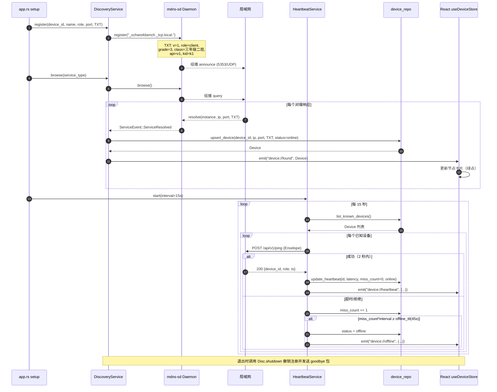
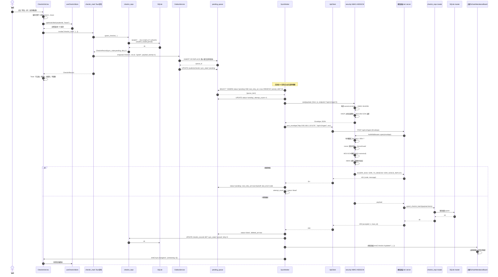
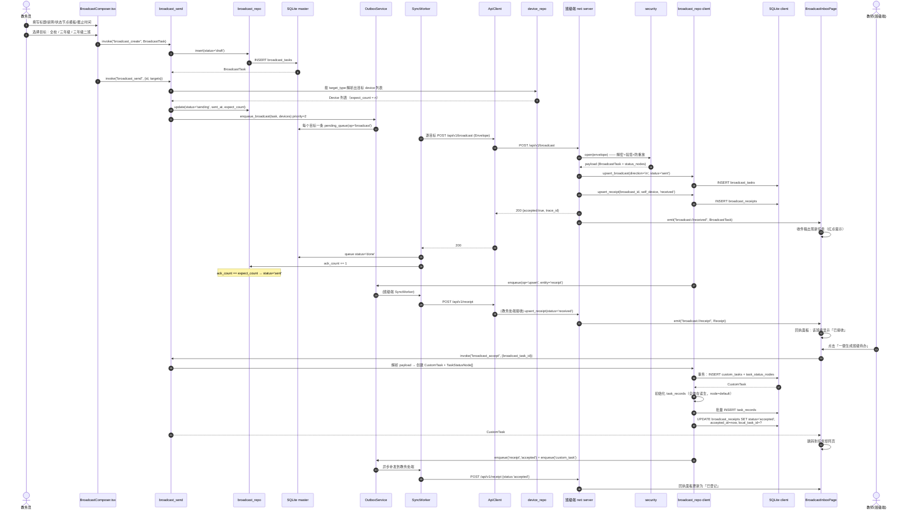
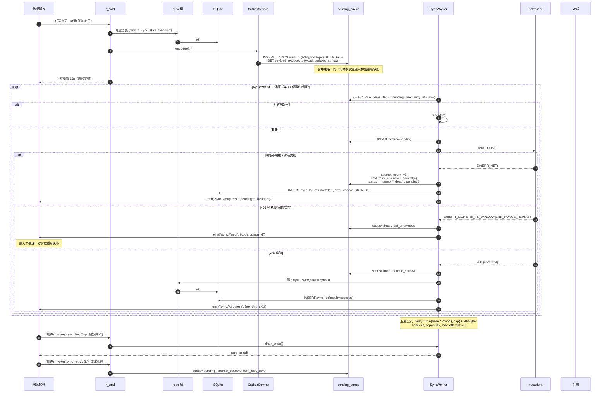
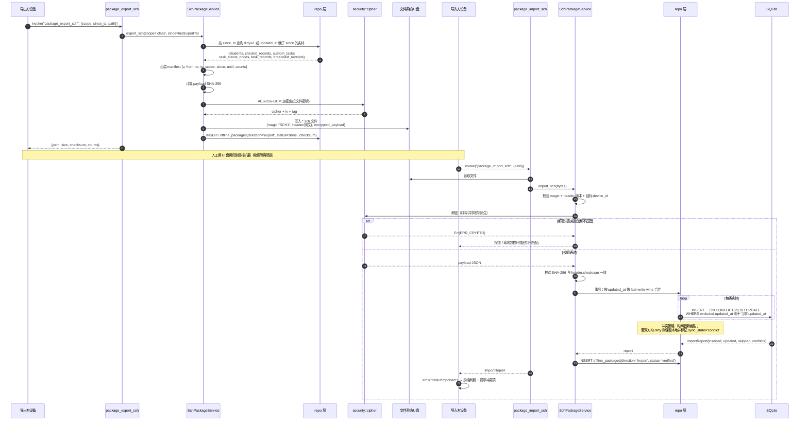

# 局域网分布式教务与班级协同工作台 — 系统架构设计

> 项目代号：`lan-workbench`
> 版本：v1.0（首版架构）
> 文档状态：已冻结，供工程实现使用
> 关联文档：`docs/02-ddl.sql`（数据结构）、`docs/03-tasks.md`（任务分解）

---

## 1. 项目概述

### 1.1 目标

一款跨平台桌面应用（Windows / macOS / Linux），运行在**无中心服务器的纯局域网**环境（校园网 / 教室局域网，可能无外网、无 DNS、无 DHCP 保障）。同一份二进制通过**首次启动向导**或本地配置切换为两种角色：

| 角色 | 代号 | 使用者 | 核心诉求 |
|---|---|---|---|
| 班级端 | `client` | 讲台机 / 教师笔记本 | 名册管理、反向考勤、自定义任务矩阵、接收教务指令 |
| 教务处端 | `master` | 教务处 PC | 节点监控、全校考勤大屏、统一任务下发、统计导出 |

### 1.2 核心设计约束

1. **无中心服务器**：任意节点可随时离线，系统必须"最终一致"而非"强一致"。
2. **Local-First**：所有交互 0 延迟，100% 本地落库成功才算操作成功；网络只是副作用。
3. **免配置组网**：教师不应输入任何 IP/端口，设备插上网线即可互见。
4. **大屏可读性**：教室大屏 3~5 米可视距离，字号 ≥ 18px（缩放后 ≥ 22px），高对比度。

### 1.3 非目标（首版不做）

- 云端同步、账号体系、多租户
- 移动端 / Web 端
- 实时音视频、IM 聊天
- 跨网段（VLAN）发现（需额外中继，见 §9 待明确）

---

## 2. 技术选型与关键决策

### 2.1 技术栈清单

| 层 | 选型 | 版本 | 说明 |
|---|---|---|---|
| 桌面壳 | Tauri | v2.0 | Rust 内核，产物 ~10MB，无 Chromium 打包 |
| 前端框架 | React | 18.x | 函数组件 + Hooks |
| 语言 | TypeScript | 5.x | 严格模式 `strict: true` |
| 构建 | Vite | 5.x | Tauri 官方推荐，`vite-plugin-tauri` 无需 |
| 样式 | Tailwind CSS | v3.4 | 大屏原子类 + 自定义 `fontSize` scale |
| 样式后处理 | PostCSS + Autoprefixer | 8.x/10.x | Tailwind v3 必需 |
| 图标 | lucide-react | 0.4xx | 线性图标，stroke 可调，适配大屏 |
| 路由 | react-router-dom | 6.x | 两个模式共用一套路由，按 mode 守卫 |
| 状态 | zustand | 4.x | 轻量、无 Provider 嵌套，适合中小规模 |
| Excel | SheetJS (xlsx) | 0.18.x | 前端解析 `.xlsx`；导出用 JSZip |
| 数据库 | SQLite | via `tauri-plugin-sql` v2 | 单文件、零配置、事务 |
| 自发现 | mdns-sd | 0.11.x | 纯 Rust，无 Avahi/Bonjour 依赖 |
| P2P API | Axum | 0.7.x | tokio 生态，中间件模型清晰 |
| HTTP 客户端 | reqwest | 0.12.x | rustls，连接池 |
| 加密 | `aes-gcm` + `hmac` + `sha2` | 0.10/0.12/0.10 | RustCrypto 官方实现 |
| 序列化 | serde / serde_json | 1.x | Rust ↔ TS 契约层 |
| Excel(Rust) | calamine / rust_xlsxwriter | 0.24/0.7x | 可选：若前端 SheetJS 性能不足则下沉 |

### 2.2 关键决策与理由

#### 决策 1：为什么用 mdns-sd 而不是手写 UDP 广播？

- **跨平台一致性**：mDNS 是标准协议（RFC 6762/6763），Windows/macOS/Linux 行为一致；裸 UDP 广播在跨 VLAN、多网卡、防火墙场景下极易失效。
- **携带元数据**：mDNS 的 **TXT Record** 可以一次性带回 `class_name`、`grade`、`role`、`api_version`、`key_id`，**发现即完成建联**，省掉一次握手请求。
- **免配置**：不需要用户填 IP。服务类型固定为 `_schworkbench._tcp.local.`，实例名 = 设备名。
- **Rust 原生**：`mdns-sd` 是纯 Rust 实现（不依赖 Avahi/Bonjour 系统服务），避免 Windows 上 Bonjour 未安装导致崩溃的经典问题。
- **取舍**：mDNS 默认只在同一二层广播域内生效。跨 VLAN 场景首版不支持（见 §9）。

#### 决策 2：为什么 P2P API 用 Axum 而不是 gRPC / 原始 TCP？

- **零代码生成**：不需要 `.proto` 编译链，契约就是一个 JSON Envelope，前端/Rust 都能直接读懂、抓包调试。
- **运维友好**：局域网排障时教师或实施人员可以直接 `curl` / 浏览器访问 `http://ip:5178/api/v1/ping` 验证连通性。
- **中间件模型**：HMAC 校验、时间戳窗口、nonce 防重放，全部收敛为一个 `auth_middleware`，业务逻辑零感知。
- **生态契合**：与 `reqwest`、`tower` 同源，超时/重试/限流开箱即用。
- **性能足够**：单班 60 人，全校 30 班，峰值 QPS < 50，Axum 完全无压力。

#### 决策 3：为什么 Local-First + Outbox，而不是"直接调 API"？

教室网络是**不可靠网络**的典型：Wi-Fi 抖动、笔记本合盖休眠、教务处 PC 关机。如果 UI 依赖网络返回：

- 教师点一次考勤要转圈 2 秒 → 体验崩溃；
- 网络断开 → 数据丢失或需要复杂的错误弹窗；
- 教务处端关机 → 班级端无法工作。

**Local-First + Outbox 的收益**：

1. UI 只信任 SQLite，写入耗时 < 5ms，交互 0 等待；
2. 网络是**后台异步副作用**，失败静默入队，成功后自动补发；
3. 天然支持"教务处端事后开机"——队列一直重试到对端在线；
4. 离线队列条目以 `(entity_type, entity_id, op_type, target)` 唯一索引**合并**，断网 1 小时后恢复不会造成 N 次重复推送。

#### 决策 4：模式切换（client / master）如何生效？

采用**三段式**，兼顾灵活性与安全性：

```
优先级 1: 启动参数   --mode=master              （最高，用于实施/调试）
优先级 2: 数据库配置 app_settings.app_mode      （首次启动向导写入，用户可改）
优先级 3: 默认值     client
```

- 首次启动（`app_settings.first_run_done = false`）强制进入 `SetupPage` 向导：选择模式 → 填身份（年级/班级 或 学校名）→ 生成/输入共享密钥 → 写入 DB。
- 切换模式**无需重启**：Rust 侧发出 `mode://changed` 事件，React 侧 `useBootstrap` 监听后重建路由与菜单；仅 mDNS 服务注册与 Axum 路由需要重新装配，由 `app.rs` 热切换。
- 模式决定：① 前端可见路由 ② mDNS TXT 中的 `role` ③ Axum 是否暴露 `/api/v1/broadcast`（仅 master 接受下发）。

#### 决策 5：为什么 SQLite 而不是文件 JSON / IndexedDB？

- 需要**关系查询**（"三年级二班今天缺勤的女生"）与**聚合**（全校出勤率），JSON 手工实现成本高且易错。
- 需要**事务**保证名册导入的原子性（500 行导入失败要整体回滚）。
- `tauri-plugin-sql` 提供**内建 migration 机制**，版本演进可控。
- 单文件便于 **U 盘离线包**场景（直接拷贝 `.db` 或导出 `.sch`）。

---

## 3. 完整目录树

> 图例：`★` = 本文档交付物（已落盘）；其余为待实现文件。
> 树中每个文件后 `#` 注释说明其职责。

```
lan-workbench/
├── package.json                              # 前端依赖与脚本(tauri/dev/build/preview)，含 @tauri-apps/api、@tauri-apps/cli
├── package-lock.json                         # 依赖锁文件，保证团队构建一致
├── pnpm-lock.yaml                            # 若使用 pnpm 则改为此文件（与上一项二选一）
├── vite.config.ts                            # Vite 配置：host 固定端口 1420、clearScreen=false、TAURI_ENV 条件编译、路径别名 @
├── tsconfig.json                             # TS 严格模式配置，含 paths 映射 @/* -> src/*
├── tsconfig.node.json                        # 供 vite.config.ts 使用的 Node 侧 TS 配置
├── tailwind.config.js                        # Tailwind 主题扩展：大屏 fontSize scale、高对比色板、lucide 图标尺寸
├── postcss.config.js                         # PostCSS：tailwindcss + autoprefixer 插件链
├── index.html                                # Vite 入口 HTML，挂载 #root，注入字体与大屏 viewport meta
├── .gitignore                                # 忽略 node_modules、dist、src-tauri/target、*.db、*.sch
├── .env.example                              # 环境变量样例：VITE_API_PORT、VITE_MDNS_TYPE、VITE_DEBUG
├── README.md                                 # 项目说明：安装、开发、打包、U盘离线包使用说明
│
├── docs/                                     # ★ 设计文档目录
│   ├── 01-architecture.md                    # ★ 本文档：系统架构设计
│   ├── 02-ddl.sql                            # ★ 完整 SQLite 建表语句（可直接执行）
│   └── 03-tasks.md                           # ★ 任务分解与共享知识
│
├── public/                                   # 静态资源，原样拷贝到 dist
│   ├── favicon.svg                           # 应用图标（SVG，适配深浅色）
│   └── empty-illustration.svg                # 空状态插画（无学生/无任务/无节点）
│
├── src/                                      # ========== React 前端 ==========
│   ├── main.tsx                              # React 入口：createRoot + RouterProvider + 全局样式导入
│   ├── App.tsx                               # 应用根组件：AppShell 布局 + 路由出口 + Toast/Modal 全局挂载点
│   ├── index.css                             # Tailwind 三指令 + 全局基线样式（大屏最小字号、滚动条、焦点环）
│   ├── vite-env.d.ts                         # Vite 客户端类型声明
│   │
│   ├── types/                                # —— 类型契约层（与 Rust 结构体一一对应）——
│   │   ├── index.ts                          # 类型统一出口（barrel file）
│   │   ├── models.ts                         # 领域模型：Student/CheckinRecord/CustomTask/TaskStatusNode/TaskRecord/Device
│   │   ├── api.ts                            # 传输模型：Envelope、SignedRequest、ApiResponse<T>、Page<T>、SyncPayload
│   │   ├── broadcast.ts                      # 广播模型：BroadcastTask、BroadcastReceipt、TargetSelector
│   │   ├── events.ts                         # Tauri 事件契约：事件名常量 + 各事件 Payload 类型
│   │   └── enums.ts                          # 枚举：AppMode、StudentStatus、CheckinState、TaskStatus、SyncState、ErrorCode
│   │
│   ├── constants/                            # —— 常量层 ——
│   │   ├── app.ts                            # 核心常量：API_PORT=5178、MDNS_SERVICE_TYPE、API_VERSION、心跳/超时/重试周期
│   │   ├── status.ts                         # 状态字典：考勤与任务节点的 label/emoji/color/icon/循环顺序 映射表
│   │   ├── errorCodes.ts                     # 错误码 → 中文提示 映射（与 Rust error.rs 对齐）
│   │   └── ui.ts                             # UI 常量：大屏断点、字号档位、卡片尺寸、虚拟滚动阈值
│   │
│   ├── lib/                                  # —— 基础能力层 ——
│   │   ├── tauri.ts                          # invoke 封装：统一错误归一化、loading 埋点、命令名常量调用
│   │   ├── events.ts                         # listen/emit 封装：useTauriEvent 底层，自动卸载监听
│   │   ├── db.ts                             # 数据访问服务：按领域分组的查询/变更函数（调用 tauri 命令）
│   │   ├── format.ts                         # 格式化：毫秒时间戳→日期、出勤率百分比、姓名脱敏
│   │   ├── excel.ts                          # xlsx 导入解析（SheetJS）+ 列映射 + 行级校验报告
│   │   ├── exporter.ts                       # xlsx 导出（SheetJS + JSZip）：多维统计表、名册模板
│   │   ├── csv.ts                            # csv 解析（含 GBK/UTF-8 BOM 兼容）
│   │   ├── download.ts                       # 保存文件：tauri-plugin-dialog 选路 + fs 写盘
│   │   └── crypto.ts                         # 前端侧工具：UUID 生成、Base64、校验和（不参与 HMAC 签名）
│   │
│   ├── store/                                # —— zustand 状态层 ——
│   │   ├── useAppStore.ts                    # 全局态：appMode、deviceId、grade/className、uiScale、theme、在线状态
│   │   ├── useStudentStore.ts                # 名册态：学生列表、筛选(在读/请假/转出)、导入中状态
│   │   ├── useCheckinStore.ts                # 考勤态：当前日期/时段、标记缓存、乐观更新与回滚
│   │   ├── useTaskStore.ts                   # 任务态：任务列表、当前任务、状态节点、矩阵单元格缓存
│   │   ├── useDeviceStore.ts                 # 节点态：mDNS 发现的设备、心跳、离线判定
│   │   ├── useBroadcastStore.ts              # 广播态：下发任务、回执汇总、班级端收件箱
│   │   └── useQueueStore.ts                  # 同步态：待发队列长度、最近同步日志、补发中标记
│   │
│   ├── hooks/                                # —— 自定义 Hook ——
│   │   ├── useTauriEvent.ts                  # 订阅 Tauri 事件并返回最新 payload
│   │   ├── useBootstrap.ts                   # 启动引导：读取设置、判定首次运行、装配模式、订阅全局事件
│   │   ├── useAutoSync.ts                    # 同步驱动：监听队列变化 + 定时触发 flush
│   │   ├── useBigScreen.ts                   # 大屏适配：按屏幕尺寸自动设置 uiScale
│   │   ├── useDebouncedCallback.ts           # 防抖（搜索、备注输入）
│   │   └── useKeyboardCycle.ts               # 键盘快捷键：空格/回车循环切换考勤状态
│   │
│   ├── components/                           # —— 组件层 ——
│   │   ├── layout/
│   │   │   ├── AppShell.tsx                  # 外壳布局：侧边导航 + 顶栏 + 内容区 + 状态栏
│   │   │   ├── SideNav.tsx                   # 侧边导航：按 appMode 渲染 client/master 菜单
│   │   │   ├── TopBar.tsx                    # 顶栏：模式徽标、班级/学校名、日期、全局搜索入口
│   │   │   ├── ModeBadge.tsx                 # 模式徽标：班级端/教务处端 视觉区分
│   │   │   ├── SyncIndicator.tsx             # 同步指示器：待发数量、补发动画、离线/在线状态灯
│   │   │   └── StatusBar.tsx                 # 底部状态栏：本地库路径、端口、已发现节点数
│   │   │
│   │   ├── ui/                               # 通用基础组件（大屏友好、高对比）
│   │   │   ├── Button.tsx                    # 按钮：尺寸 xl/lg/md，variant primary/danger/ghost
│   │   │   ├── IconButton.tsx                # 图标按钮：lucide 图标，≥44px 触控区
│   │   │   ├── Card.tsx                      # 卡片容器：标题/操作区/内容插槽
│   │   │   ├── Badge.tsx                     # 徽标：状态色标签
│   │   │   ├── Modal.tsx                     # 模态框：焦点陷阱、Esc 关闭、大屏居中放大
│   │   │   ├── Drawer.tsx                    # 右侧抽屉：详情/编辑面板
│   │   │   ├── Select.tsx                    # 下拉选择：大字号选项
│   │   │   ├── Input.tsx                     # 输入框：标签、校验态、前后缀
│   │   │   ├── Textarea.tsx                  # 多行输入：备注录入
│   │   │   ├── Toggle.tsx                    # 开关：启用评分/备注等
│   │   │   ├── Tabs.tsx                      # 页签：网格视图 / 表格视图 切换
│   │   │   ├── Table.tsx                     # 表格：粘性表头、斑马纹、大行高
│   │   │   ├── Tooltip.tsx                   # 悬浮提示
│   │   │   ├── EmptyState.tsx                # 空状态：插画 + 引导按钮
│   │   │   ├── Spinner.tsx                   # 加载指示
│   │   │   ├── ConfirmDialog.tsx             # 二次确认（删除、覆盖导入）
│   │   │   ├── Toast.tsx                     # 轻提示：成功/失败/待同步
│   │   │   └── ProgressBar.tsx               # 进度条：导入/导出/补发进度
│   │   │
│   │   ├── student/
│   │   │   ├── StudentImportDialog.tsx       # 导入弹窗：选择文件、列映射预览、校验报告、确认导入
│   │   │   ├── StudentTable.tsx              # 名册表格：排序、筛选、批量改状态
│   │   │   ├── StudentStatusBadge.tsx        # 状态徽标：在读/请假/已转出
│   │   │   ├── StudentEditDrawer.tsx         # 学生编辑抽屉：信息、状态变更、备注
│   │   │   └── StudentPicker.tsx             # 学生选择器：批量操作对象选择
│   │   │
│   │   ├── checkin/
│   │   │   ├── CheckinGrid.tsx               # 考勤网格：全班卡片矩阵，反向标记主界面
│   │   │   ├── CheckinStudentCard.tsx        # 学生卡片：头像/姓名 + 状态色 + 点击循环切换
│   │   │   ├── CheckinSummaryBar.tsx         # 汇总条：出勤/请假/缺勤计数 + 出勤率
│   │   │   ├── CheckinDatePicker.tsx         # 日期与时段选择
│   │   │   └── CheckinExceptionList.tsx      # 异常名单：缺勤/请假快速复核
│   │   │
│   │   ├── task/
│   │   │   ├── TaskList.tsx                  # 任务列表：卡片式，进度概览
│   │   │   ├── TaskEditorDialog.tsx          # 任务编辑器：标题/类型/截止/视图/评分开关
│   │   │   ├── StatusNodeEditor.tsx          # 状态节点编辑器：2~4 个节点的增删改序、颜色图标
│   │   │   ├── TaskMatrixGrid.tsx            # 网格卡片矩阵视图（大屏主视图）
│   │   │   ├── TaskMatrixTable.tsx           # 表格矩阵视图（信息密度视图）
│   │   │   ├── TaskCell.tsx                  # 矩阵单元格：点击循环切换状态节点
│   │   │   ├── ScorePopover.tsx              # 评分气泡：0-100 滑杆 + 快捷档位
│   │   │   ├── NotePopover.tsx               # 备注气泡：文字备注输入
│   │   │   ├── TaskProgressSummary.tsx       # 任务进度：各节点人数分布条
│   │   │   └── TaskDetailDrawer.tsx          # 任务详情：配置查看、批量操作、导出
│   │   │
│   │   ├── broadcast/
│   │   │   ├── BroadcastList.tsx             # 下发任务列表（master）/ 收件箱（client）
│   │   │   ├── BroadcastComposer.tsx         # 下发编辑器：标题、说明、内置状态节点模板、截止时间
│   │   │   ├── BroadcastTargetPicker.tsx     # 目标选择：全校/年级/班级/指定设备
│   │   │   ├── BroadcastReceiptPanel.tsx     # 回执面板：各班级已接收/已登记/已完成
│   │   │   └── BroadcastAcceptBar.tsx        # 班级端：一键生成班级待办
│   │   │
│   │   ├── dashboard/                        # 教务处端大屏
│   │   │   ├── DeviceMonitorPanel.tsx        # 节点监控：在线设备卡片、离线灰显、延迟
│   │   │   ├── SchoolAttendanceBoard.tsx     # 全校考勤大屏：各班出勤率环形/条形汇总
│   │   │   ├── UnsubmittedClassList.tsx      # 未提交考勤班级高亮列表
│   │   │   ├── ExceptionStudentList.tsx      # 异常学生名单：缺勤/请假，可按班级筛选
│   │   │   ├── StatsCards.tsx                # 统计卡片：在校人数、出勤率、任务完成率
│   │   │   └── ExportPanel.tsx               # 导出面板：维度选择、时间范围、导出 xlsx
│   │   │
│   │   ├── sync/
│   │   │   ├── PendingQueuePanel.tsx         # 待发队列：数量、失败项、手动重试
│   │   │   ├── SyncLogPanel.tsx              # 同步日志：成功/失败明细、错误码
│   │   │   └── SchPackageDialog.tsx          # .sch 离线包：导出/导入向导
│   │   │
│   │   └── setup/
│   │       ├── FirstRunWizard.tsx            # 首次启动向导容器：步骤编排与校验
│   │       ├── ModeSelectStep.tsx            # 第一步：选择班级端 / 教务处端
│   │       ├── IdentityStep.tsx              # 第二步：填写年级班级 / 学校名、设备名
│   │       └── KeyStep.tsx                   # 第三步：生成或输入共享密钥、显示密钥指纹
│   │
│   ├── pages/                                # —— 页面层（路由直达）——
│   │   ├── SetupPage.tsx                     # 首次启动设置页（向导容器）
│   │   ├── SettingsPage.tsx                  # 设置页：模式切换、端口、密钥轮换、UI 缩放、关于
│   │   ├── client/
│   │   │   ├── ClientHomePage.tsx            # 班级端首页：今日概览、快捷入口
│   │   │   ├── CheckinPage.tsx               # 快捷考勤页（反向标记主界面）
│   │   │   ├── StudentsPage.tsx              # 学生名册页
│   │   │   ├── TasksPage.tsx                 # 任务管理页（列表 + 编辑器入口）
│   │   │   ├── TaskMatrixPage.tsx            # 任务矩阵页（网格/表格双视图）
│   │   │   └── BroadcastInboxPage.tsx        # 教务指令收件箱
│   │   └── master/
│   │       ├── MasterHomePage.tsx            # 教务处端首页（大屏总览）
│   │       ├── DevicesPage.tsx               # 节点监控页
│   │       ├── AttendanceBoardPage.tsx       # 实时考勤大屏页
│   │       ├── BroadcastPage.tsx             # 统一任务下发页
│   │       └── AnalyticsPage.tsx             # 数据分析与导出页
│   │
│   └── router/
│       └── index.tsx                         # 路由表：按 appMode 守卫，未初始化重定向 SetupPage
│
└── src-tauri/                                # ========== Rust 后台 ==========
    ├── Cargo.toml                            # Rust 依赖清单：tauri、axum、tokio、sqlx、mdns-sd、aes-gcm、hmac、sha2、serde、reqwest、calamine
    ├── Cargo.lock                            # 依赖锁文件
    ├── build.rs                              # Tauri 构建脚本（tauri_build::build()）
    ├── tauri.conf.json                       # Tauri 主配置：产品名、窗口尺寸(默认 1600x1000)、标识符、bundle、allowlist 前置
    ├── tauri.macos.conf.json                 # macOS 平台覆盖配置：minimumSystemVersion、标题栏样式
    ├── tauri.windows.conf.json               # Windows 平台覆盖配置：WebView2、安装包类型
    ├── tauri.linux.conf.json                 # Linux 平台覆盖配置：deb/appimage 依赖
    ├── capabilities/
    │   └── default.json                      # Tauri v2 权限能力清单：core:default、sql、dialog、fs、event 权限
    ├── icons/                                # 应用图标多尺寸
    │   ├── 32x32.png
    │   ├── 128x128.png
    │   ├── 128x128@2x.png
    │   ├── icon.icns                         # macOS 图标
    │   └── icon.ico                          # Windows 图标
    ├── migrations/
    │   └── 001_init.sql                      # ★ 数据库初始化迁移（与 docs/02-ddl.sql 一致）
    └── src/
        ├── main.rs                           # 进程入口：调用 lib::run()
        ├── lib.rs                            # 库入口：导出 run() 与模块声明
        ├── app.rs                            # Tauri Builder 装配：插件、state、invoke_handler、setup/setup 钩子
        ├── error.rs                          # 统一错误类型 AppError + ErrorCode 枚举 + Serialize 到前端
        ├── state.rs                          # AppState：db pool、device_id、AppMode、discovery handle、shutdown tx
        │
        ├── config/
        │   ├── mod.rs                        # 配置模块出口
        │   ├── constants.rs                  # 常量：默认端口、mDNS 类型、版本、超时、退避基数
        │   └── settings.rs                   # 设置读写：KV 存取、默认值、类型解析（string/number/bool/json）
        │
        ├── db/
        │   ├── mod.rs                        # 数据库初始化：连接串、PRAGMA、migration 注册与执行
        │   ├── migrations.rs                 # 迁移列表定义（version/description/sql/kind）
        │   ├── models.rs                     # Rust 领域结构体：与 TS types/models.ts 一一对应
        │   └── repo/
        │       ├── mod.rs                    # repo 统一出口与公共分页/软删工具
        │       ├── student_repo.rs           # 名册 CRUD、批量导入、状态变更、按班级查询
        │       ├── checkin_repo.rs           # 考勤 upsert、按日期/班级查询、汇总聚合
        │       ├── task_repo.rs              # 任务 CRUD、状态节点 CRUD、任务记录 upsert、矩阵查询
        │       ├── broadcast_repo.rs         # 广播任务 CRUD、回执登记、回执统计
        │       ├── device_repo.rs            # 节点 upsert、心跳更新、离线标记、在线列表
        │       ├── queue_repo.rs             # 队列入队(合并)/出队/重试计数/清理
        │       ├── sync_repo.rs              # 同步日志写入与查询
        │       ├── package_repo.rs           # .sch 离线包审计记录
        │       └── settings_repo.rs          # app_settings 读写封装
        │
        ├── net/
        │   ├── mod.rs                        # 网络模块出口
        │   ├── server.rs                     # Axum Router 装配 + 中间件栈 + 优雅关闭
        │   ├── handlers.rs                   # 路由处理：/ping /ingest /broadcast /pull /package
        │   ├── middleware.rs                 # 安全中间件：Envelope 解密 → HMAC 校验 → 时间戳/nonce 校验
        │   ├── client.rs                     # reqwest 客户端：签名、发送、超时、连接池
        │   ├── discovery.rs                  # mdns-sd：服务注册(advertise) + 浏览(browse) + TXT 解析
        │   └── heartbeat.rs                  # 心跳任务：周期 ping 已知节点、更新 devices.status
        │
        ├── security/
        │   ├── mod.rs                        # 安全模块出口
        │   ├── hmac.rs                       # 规范化字符串构造 + HMAC-SHA256 签名/验签 + 常量时间比较
        │   ├── cipher.rs                     # AES-256-GCM：密钥派生(HKDF)、加密、解密
        │   ├── envelope.rs                   # Envelope 结构体定义、序列化、完整性校验
        │   ├── nonce.rs                      # nonce 缓存与重放防护（内存 LRU + 落库持久化）
        │   └── keystore.rs                   # 密钥读取/生成/轮换、kid 管理（优先系统钥匙串）
        │
        ├── sync/
        │   ├── mod.rs                        # 同步模块出口
        │   ├── outbox.rs                     # 入队封装：业务变更 → 队列条目（含合并策略）
        │   ├── worker.rs                     # 补发工作循环：取队 → 解析目标 → 发送 → 成功/退避
        │   ├── backoff.rs                    # 指数退避与抖动计算
        │   └── sch_package.rs                # .sch 离线包：打包/加密/校验和/解包/合并导入
        │
        ├── import_export/
        │   ├── mod.rs                        # 导入导出模块出口
        │   ├── xlsx.rs                       # calamine 解析 .xlsx（大文件 fallback 到 Rust 侧）
        │   ├── csv.rs                        # csv 解析与编码探测
        │   └── export.rs                     # rust_xlsxwriter 生成统计报表
        │
        └── commands/
            ├── mod.rs                        # invoke_handler 命令汇总注册
            ├── settings_cmd.rs               # 设置命令：get/set/mode 切换/密钥轮换/完成向导
            ├── student_cmd.rs                # 名册命令：list/upsert/batch_import/update_status
            ├── checkin_cmd.rs                # 考勤命令：list/mark/batch_mark/daily_summary
            ├── task_cmd.rs                   # 任务命令：crud/node_crud/upsert_record/matrix_query
            ├── broadcast_cmd.rs              # 广播命令：create/send/list/receipts/accept
            ├── device_cmd.rs                 # 节点命令：list/refresh/ping/forget
            ├── sync_cmd.rs                   # 同步命令：queue_list/flush/retry/log_list
            └── package_cmd.rs                # 离线包命令：export_sch/import_sch/verify
```

---

## 4. Rust 模块划分与职责矩阵

| 模块 | 主要类型 / 函数 | 职责 | 依赖 | 是否阻塞 UI |
|---|---|---|---|---|
| `config::constants` | `API_PORT`, `MDNS_SERVICE_TYPE`, `API_VERSION` | 单一常量源 | — | 否 |
| `config::settings` | `AppSettings`, `get_mode()`, `set_mode()` | KV 设置读写、默认值兜底 | `db::repo::settings_repo` | 否 |
| `db::mod` | `init_db()` | 建连接、`PRAGMA foreign_keys=ON`、执行迁移 | `tauri-plugin-sql` | 启动时一次 |
| `db::models` | `Student`, `CheckinRecord`, … | serde 结构体，TS 契约源 | serde | — |
| `db::repo::*` | `*_repo::list/upsert/delete/…` | 全部 SQL 唯一出口，业务层不写裸 SQL | `sqlx` | 否（异步） |
| `security::hmac` | `canonical_string()`, `sign()`, `verify()` | 规范化 + 签名验签（常量时间比较） | `hmac`, `sha2` | 否 |
| `security::cipher` | `derive_key()`, `encrypt()`, `decrypt()` | HKDF 派生会话密钥 + AES-256-GCM | `aes-gcm`, `hkdf` | 否 |
| `security::envelope` | `Envelope`, `seal()`, `open()` | 信封组装/拆解、结构校验 | `security::*` | 否 |
| `security::nonce` | `NonceGuard::check_and_insert()` | 重放防护，TTL = 2×窗口 | `dashmap` | 否 |
| `security::keystore` | `load_root_key()`, `rotate()` | 密钥生成/读取/轮换，kid 管理 | `keyring` | 否 |
| `net::discovery` | `DiscoveryService::register()/browse()` | mDNS 注册与浏览，产出 `DeviceFound` 事件 | `mdns-sd` | 否（后台任务） |
| `net::server` | `build_router()`, `serve()` | Axum 服务与中间件栈、优雅关闭 | `axum`, `tokio` | 否 |
| `net::middleware` | `auth_middleware()` | 解密 → 验签 → 时间戳 → nonce | `security::*` | 否 |
| `net::handlers` | `ping()`, `ingest()`, `broadcast()`, `pull()` | 业务端点，写库后回 ACK | `db::repo` | 否 |
| `net::client` | `post_envelope()` | 封包 → 签名 → 发送 → 解析响应 | `reqwest` | 否 |
| `net::heartbeat` | `heartbeat_loop()` | 周期 ping，更新 `devices` 状态 | `net::client` | 否 |
| `sync::outbox` | `enqueue()`, `enqueue_batch()` | 业务变更转队列条目（合并） | `queue_repo` | 否 |
| `sync::worker` | `flush_loop()`, `drain_once()` | 后台补发循环、退避、死信 | `net::client` | 否 |
| `sync::backoff` | `next_delay()` | 指数退避 + 抖动 | — | 否 |
| `sync::sch_package` | `export_sch()`, `import_sch()` | 离线包加解密与合并 | `security::cipher` | 是（显式进度） |
| `import_export::*` | `parse_xlsx()`, `export_report()` | 名册解析与报表生成 | `calamine`, `rust_xlsxwriter` | 是（显式进度） |
| `commands::*` | `#[tauri::command] fn *_cmd()` | 前端唯一入口，参数校验 + 错误归一 | 各业务模块 | 视命令而定 |
| `app.rs` | `build_app()` | 装配插件/state/命令/后台任务 | 全部 | — |

### 4.1 分层依赖规则（强制）

```
commands  →  sync / import_export / config  →  security  →  (无业务依赖)
                        ↓
                    db::repo  →  db::models
net::handlers  →  db::repo + security        （net 不反向依赖 commands）
net::server    →  net::middleware → security
```

- **禁止** `security` 依赖 `db`（密钥无关业务）；
- **禁止** `commands` 直接写 SQL，必须经 `repo`；
- **允许** `sync::worker` 调用 `net::client`，但 `net` 不得调用 `sync`（避免环）。

---

## 5. 数据结构与接口

### 5.1 领域模型与核心类（Mermaid classDiagram）

```mermaid
classDiagram
    %% ===================== 枚举与值对象 =====================
    class AppMode {
        <<enumeration>>
        Client
        Master
    }
    class StudentStatus {
        <<enumeration>>
        Active
        Leave
        Transferred
    }
    class CheckinState {
        <<enumeration>>
        Present
        Leave
        Absent
        Late
    }
    class SyncState {
        <<enumeration>>
        Local
        Pending
        Synced
        Conflict
    }
    class ErrorCode {
        <<enumeration>>
        ERR_DB
        ERR_NET
        ERR_SIGN
        ERR_CRYPTO
        ERR_TS_WINDOW
        ERR_NONCE_REPLAY
        ERR_VALIDATION
        ERR_NOT_FOUND
        ERR_MODE
    }

    %% ===================== 领域实体 =====================
    class BaseEntity {
        +String id
        +i64 created_at
        +i64 updated_at
        +Option~i64~ deleted_at
        +SyncState sync_state
        +bool dirty
    }

    class Student {
        +String student_no
        +String name
        +String gender
        +Option~String~ grade
        +Option~String~ class_name
        +Option~i64~ seat_no
        +StudentStatus status
        +Option~i64~ status_since
        +Option~String~ note
        +Option~String~ import_batch_id
    }
    class ImportBatch {
        +String batch_name
        +String source_type
        +i64 total_rows
        +i64 success_rows
        +i64 failed_rows
        +String status
        +Option~String~ error_report
    }
    class CheckinRecord {
        +String student_id
        +String checkin_date
        +String period
        +CheckinState state
        +Option~i64~ marked_at
        +Option~String~ note
    }
    class CustomTask {
        +String title
        +String task_type
        +String scope
        +Option~i64~ due_at
        +String status
        +String view_mode
        +bool score_enabled
        +bool note_enabled
        +Option~String~ default_node_id
        +Option~String~ broadcast_task_id
        +String source
    }
    class TaskStatusNode {
        +String task_id
        +String node_key
        +String label
        +String color_token
        +Option~String~ icon_name
        +i32 node_order
        +bool is_final
        +bool is_default
    }
    class TaskRecord {
        +String task_id
        +String student_id
        +Option~String~ node_id
        +String node_key
        +Option~i32~ score
        +Option~String~ note
        +Option~i64~ completed_at
    }
    class BroadcastTask {
        +String title
        +String payload
        +String target_type
        +Option~String~ target_value
        +Option~i64~ due_at
        +String priority
        +String publisher_device_id
        +String direction
        +String status
        +i64 expect_count
        +i64 ack_count
    }
    class BroadcastReceipt {
        +String broadcast_task_id
        +String device_id
        +String class_name
        +String status
        +Option~i64~ received_at
        +Option~i64~ accepted_at
        +Option~String~ local_task_id
    }
    class Device {
        +String device_id
        +String device_name
        +String device_role
        +Option~String~ ip_address
        +Option~i32~ port
        +String status
        +Option~i64~ last_seen_at
        +i64 miss_count
    }
    class PendingQueueItem {
        +String op_type
        +String entity_type
        +String entity_id
        +String payload
        +Option~String~ target_device_id
        +String target_endpoint
        +i32 attempt_count
        +i32 max_attempts
        +i64 next_retry_at
        +String status
        +i32 priority
    }
    class SyncLogEntry {
        +String direction
        +Option~String~ peer_device_id
        +Option~String~ endpoint
        +i64 entity_count
        +String result
        +Option~String~ error_code
        +Option~String~ trace_id
    }
    class AppSetting {
        +String setting_key
        +Option~String~ setting_value
        +String value_type
    }
    class OfflinePackage {
        +String file_name
        +String direction
        +String package_type
        +Option~String~ checksum
        +i64 size_bytes
        +String status
    }

    BaseEntity <|-- Student
    BaseEntity <|-- ImportBatch
    BaseEntity <|-- CheckinRecord
    BaseEntity <|-- CustomTask
    BaseEntity <|-- TaskStatusNode
    BaseEntity <|-- TaskRecord
    BaseEntity <|-- BroadcastTask
    BaseEntity <|-- BroadcastReceipt
    BaseEntity <|-- Device
    BaseEntity <|-- PendingQueueItem
    BaseEntity <|-- SyncLogEntry
    BaseEntity <|-- AppSetting
    BaseEntity <|-- OfflinePackage

    ImportBatch "1" --> "*" Student : 一次导入产生
    Student "1" --> "*" CheckinRecord : 考勤记录
    Student "1" --> "*" TaskRecord : 任务完成记录
    CustomTask "1" --> "*" TaskStatusNode : 2~4 个节点
    CustomTask "1" --> "*" TaskRecord : 学生矩阵
    TaskStatusNode "1" --> "*" TaskRecord : 当前节点
    BroadcastTask "1" --> "*" BroadcastReceipt : 下发回执
    BroadcastTask "1" --> "*" CustomTask : 一键生成待办
    PendingQueueItem "1" --> "*" SyncLogEntry : 补发日志
    Device "1" --> "*" PendingQueueItem : 目标设备

    %% ===================== 安全与传输 =====================
    class Envelope {
        +i32 v
        +String alg
        +String from
        +String to
        +i64 ts
        +String nonce
        +String kid
        +String iv
        +String aad
        +String cipher
        +String tag
        +String sig
        +seal(payload, ctx) Envelope
        +open(ctx) String
    }
    class HmacSigner {
        +canonical_string(method, path, ts, nonce, body_hash, device_id) String
        +sign(secret, canonical) String
        +verify(secret, canonical, given) bool
    }
    class AesGcmCipher {
        +derive_session_key(root, from, to, kid) Vec~u8~
        +encrypt(key, iv, aad, plaintext) CipherOut
        +decrypt(key, iv, aad, cipher, tag) String
    }
    class NonceGuard {
        +check_and_insert(device_id, nonce, ts) bool
        +gc(now) void
    }
    class KeyStore {
        +load_root_key() Vec~u8~
        +current_kid() String
        +rotate() String
    }

    Envelope ..> HmacSigner : 使用
    Envelope ..> AesGcmCipher : 使用
    HmacSigner ..> KeyStore : 取密钥
    AesGcmCipher ..> KeyStore : 取密钥

    %% ===================== 服务层 =====================
    class DiscoveryService {
        -ServiceDaemon daemon
        +register(device_id, name, role, port, txt) Result
        +browse() Receiver~DeviceFound~
        +shutdown() void
    }
    class ApiServer {
        -Router router
        +build_router(state) Router
        +serve(port, state) JoinHandle
        +shutdown() void
    }
    class AuthMiddleware {
        +handle(req, next) Response
    }
    class ApiClient {
        -Client http
        +post_envelope(base_url, endpoint, envelope) Result~Response~
    }
    class HeartbeatService {
        +start(state) JoinHandle
        +ping(device) Result
    }
    class OutboxService {
        +enqueue(entity_type, entity_id, op, payload) Result
        +enqueue_broadcast(task, targets) Result
        +mark_done(id) Result
        +mark_failed(id, err) Result
    }
    class SyncWorker {
        +start(state) JoinHandle
        +drain_once(state) Result~i32~
    }
    class SchPackageService {
        +export_sch(scope, since, path) Result~OfflinePackage~
        +import_sch(path) Result~ImportReport~
    }
    class AppState {
        +DbPool db
        +String device_id
        +AppMode mode
        +DiscoveryHandle discovery
        +SchedulerHandle scheduler
        +Mutex~NonceGuard~ nonce_guard
    }

    ApiServer *-- AuthMiddleware
    AuthMiddleware ..> Envelope
    ApiClient ..> Envelope
    DiscoveryService ..> Device : 产出
    HeartbeatService ..> ApiClient
    SyncWorker ..> ApiClient
    SyncWorker ..> OutboxService
    OutboxService ..> PendingQueueItem
    SchPackageService ..> AesGcmCipher
    AppState o-- DiscoveryService
    AppState o-- ApiServer
    AppState o-- SyncWorker
    AppState o-- HeartbeatService
```



### 5.2 Tauri 命令接口（前端 → Rust）

命令命名规范：`<domain>_<action>`，全部 snake_case。

| 命令 | 入参 | 出参 | 说明 |
|---|---|---|---|
| `settings_get_all` | — | `Vec<AppSetting>` | 读取全部配置 |
| `settings_set` | `{key, value, value_type}` | `()` | 写配置 |
| `settings_complete_setup` | `{mode, device_name, grade, class_name, secret}` | `()` | 完成向导，初始化密钥与身份 |
| `settings_switch_mode` | `{mode}` | `AppMode` | 热切换模式并广播事件 |
| `settings_rotate_key` | — | `{kid}` | 生成新密钥并返回 kid |
| `student_list` | `{class_name?, status?, keyword?}` | `Vec<Student>` | 名册列表 |
| `student_upsert` | `Student` | `Student` | 新增/更新 |
| `student_batch_import` | `{rows, batch_name}` | `ImportReport` | 批量导入（事务） |
| `student_update_status` | `{id, status}` | `Student` | 状态变更（转出等） |
| `checkin_list` | `{date, period}` | `Vec<CheckinRecord>` | 当日考勤 |
| `checkin_mark` | `{student_id, date, period, state}` | `CheckinRecord` | 单点标记（反向标记） |
| `checkin_batch_mark` | `{items}` | `Vec<CheckinRecord>` | 批量标记 |
| `checkin_daily_summary` | `{date}` | `Vec<DailySummary>` | 汇总 |
| `task_list` | `{status?}` | `Vec<CustomTask>` | 任务列表 |
| `task_upsert` | `CustomTask` | `CustomTask` | 任务保存 |
| `task_node_upsert` | `TaskStatusNode` | `TaskStatusNode` | 节点保存（受 4 个上限约束） |
| `task_node_delete` | `{id}` | `()` | 节点软删 |
| `task_record_upsert` | `TaskRecord` | `TaskRecord` | 矩阵单元格更新 |
| `task_matrix_query` | `{task_id}` | `TaskMatrix` | 一次性返回矩阵（学生 × 记录） |
| `broadcast_create` | `BroadcastTask` | `BroadcastTask` | 创建下发任务 |
| `broadcast_send` | `{id, targets}` | `SendReport` | 下发到目标设备 |
| `broadcast_list` | `{direction}` | `Vec<BroadcastTask>` | 列表 |
| `broadcast_receipts` | `{broadcast_task_id}` | `Vec<BroadcastReceipt>` | 回执汇总 |
| `broadcast_accept` | `{broadcast_task_id}` | `CustomTask` | 班级端一键生成待办 |
| `device_list` | — | `Vec<Device>` | 在线设备 |
| `device_refresh` | — | `Vec<Device>` | 强制刷新 mDNS |
| `device_forget` | `{device_id}` | `()` | 忽略节点 |
| `sync_queue_list` | `{status?}` | `Vec<PendingQueueItem>` | 待发队列 |
| `sync_flush` | — | `{sent, failed}` | 立即补发一次 |
| `sync_retry` | `{id}` | `()` | 重试单条 |
| `sync_log_list` | `{limit}` | `Vec<SyncLogEntry>` | 同步日志 |
| `package_export_sch` | `{scope, since_ts, path}` | `OfflinePackage` | 导出离线包 |
| `package_import_sch` | `{path}` | `ImportReport` | 导入离线包 |

### 5.3 HTTP 端点（Rust ↔ Rust，P2P）

基址：`http://{ip}:{port}/api/v1`

| 方法 | 路径 | 谁提供 | 说明 |
|---|---|---|---|
| `GET` | `/ping` | 全部 | 心跳；返回 `{device_id, role, ts}`，仍走完整签名 |
| `POST` | `/ingest` | master + client | 接收增量（学生/考勤/任务/记录），幂等 upsert |
| `POST` | `/broadcast` | client（仅接收） | master → client 下发广播任务 |
| `POST` | `/receipt` | master | client → master 回执（received/accepted/done） |
| `GET` | `/pull` | master | client 主动拉取未收广播（补偿 mDNS 抖动） |
| `POST` | `/package` | 全部 | 接收 `.sch` 离线包二进制（U 盘兜底的网传版） |

所有请求体为**加密信封**，见 §7。

---

## 6. 关键时序图

### 6.1 ① mDNS 发现 + 心跳



### 6.2 ② 班级端考勤变更 → 本地写入 → 增量推送 → 教务处端落库



### 6.3 ③ 教务处下发广播任务 → 班级端登记



### 6.4 ④ 离线队列补发



### 6.5 ⑤ `.sch` 离线包导出 / 导入



---

## 7. 安全方案

### 7.1 威胁模型（局域网场景）

| 威胁 | 风险 | 对策 |
|---|---|---|
| 伪造教务处下发假任务 | 中 | HMAC 验签，未持密钥者无法构造 |
| 抓包看到学生姓名/成绩 | 中高 | Payload AES-256-GCM 加密 |
| 重放旧报文篡改考勤 | 中 | 时间戳窗口 + nonce 去重 |
| 中间人篡改 | 中 | AAD 绑定 canonical，改一个字节即解密失败 |
| 未授权设备接入 | 低中 | 密钥不随 mDNS 广播；TXT 只放 kid 与元数据 |
| 本地数据库被拷走 | 低 | 密钥存系统钥匙串；DB 不存明文密钥 |

> 说明：本方案目标是**防内部误操作与非专业攻击者**，不抵御持密钥的合法节点作恶，也不替代校园网本身的准入控制。

### 7.2 规范化字符串（Canonical String）

签名对象必须是**完全确定**的字符串，避免 JSON 序列化顺序、空白差异导致验签失败。

```
canonical =
    "SCH1"                        "\n"
  + METHOD_UPPERCASE              "\n"      -- GET / POST
  + PATH_WITH_QUERY               "\n"      -- /api/v1/ingest （不含 host，含原始 query）
  + TIMESTAMP_MS                  "\n"      -- 十进制毫秒字符串
  + NONCE                         "\n"      -- UUID v4 小写
  + FROM_DEVICE_ID                "\n"      -- 发送方设备 UUID
  + BODY_SHA256_HEX               "\n"      -- 对「加密后信封的 cipher+tag」再哈希（见下）
  + KID                                     -- 密钥标识（无结尾换行）
```

要点：

1. 使用 `\n`（LF，0x0A）分隔，字段内**不允许**出现 `\n`（device_id/nonce 均为 UUID，天然满足）。
2. `BODY_SHA256_HEX` 对**密文**（`cipher || tag` 的 Base64 解码后字节）做 SHA-256，而非明文——保证密文与签名强绑定，任何篡改密文的行为同时破坏签名。
3. `PATH_WITH_QUERY` 取**原始路径**（Axum 的 `OriginalUri`），避免反向代理/规范化导致路径不一致。
4. `METHOD` 强制大写。

签名：

```
sig = Base64Std( HMAC_SHA256( shared_secret_b64_decode, UTF8(canonical) ) )
```

比较必须用**常量时间比较**（`subtle::ConstantTimeEq`），防时序侧信道。

### 7.3 时间戳窗口与 nonce

| 参数 | 值 | 说明 |
|---|---|---|
| 窗口 | ±300 秒 | `abs(ts - now) ≤ 300000` |
| 时钟偏移容忍 | 由窗口覆盖 | 局域网建议 master 端在 `/ping` 响应中回带 `server_ts`，client 计算 offset 并本地补偿 |
| nonce | UUID v4 | 每次请求唯一 |
| nonce 存储 | 内存 LRU(`dashmap`) + `sync_log.trace_id` 落库 | TTL = 2 × 窗口 = 600 秒 |
| 重放判定 | `(from_device_id, nonce)` 已存在 → `ERR_NONCE_REPLAY` | 命中即 401 且**不重试**（worker 直接置 dead） |

### 7.4 AES-256-GCM 密钥与 nonce 派生

**根密钥**（32 字节）：首次启动向导生成随机密钥，或由口令经 **Argon2id**（m=64MB, t=3, p=4）派生；同一局域网内所有节点共享同一根密钥。存储优先走 **系统钥匙串**（Windows Credential Manager / macOS Keychain / Secret Service），回退写 `app_settings`（标记为 `secret` 类型，文件权限 600）。

**会话密钥派生**（HKDF-SHA256）：

```
salt = SHA256( sort(from_device_id, to_device_id) 拼接 )     -- 双向一致
info = "sch-workbench/v1/aes-gcm" || kid
session_key(32B) = HKDF-SHA256( ikm = root_key, salt, info )
```

- `kid` 进入 `info`，密钥轮换后旧 `kid` 的会话密钥仍可解密历史报文（灰度期），新报文一律用新 `kid`。
- 广播场景（`to = "*"`）：`salt = SHA256("broadcast" || kid)`，全网共用一把广播会话密钥。

**消息 nonce / IV**（12 字节，GCM 标准长度）：

```
iv(12B) = random_prefix(4B) || counter(8B, 大端)
```

- 同一 `session_key` 下 **IV 必须唯一**；`counter` 由发送方单调递增并持久化（存 `app_settings`，进程重启后继续），`random_prefix` 每次请求随机生成，双保险。
- 实际实现建议：直接用 12 字节 CSPRNG 随机 IV，并在同一 `kid` 下限制报文数 < 2^32（本场景远达不到），可简化状态管理。**推荐此方案**，并在文档中记录随机 IV 的碰撞概率可忽略。
- `iv` 随信封明文传输（Base64），IV 不需要保密。

**AAD（附加认证数据）** = UTF-8 的 canonical string。这样加密与签名绑定到同一份上下文，任何字段篡改都会导致 GCM 认证失败或验签失败。

> Rust 实现提示：`aes-gcm` crate 的 `encrypt()` 返回值**已将 16 字节 tag 追加在密文尾部**，落库/传输时按 `ct[..len-16]` 与 `ct[len-16..]` 拆分为 `cipher` 与 `tag` 两个字段。

### 7.5 报文信封（Envelope）JSON 结构

```json
{
  "v": 1,
  "alg": "AES-256-GCM+HMAC-SHA256",
  "from": "9f1c2b40-6d1e-4a77-9a2f-0c5b8e3d1a11",
  "to": "b3e7a012-4c55-4f18-9d0e-77aa21cc9f34",
  "ts": 1783564800000,
  "nonce": "c0a8f31e-9b2d-4c66-8f10-5ad4e7b2c901",
  "kid": "k1",
  "iv": "8Zk3Qm1xTvQ=",
  "aad": "U0NIMQpQT1NUCi9hcGkvdjEvaW5nZXN0CjE3ODM1NjQ4MDAwMDAK...",
  "cipher": "kZ8vB2mQxL1nR7yT4wA9cE5fG6hJ0kP3sU8dV2bN1mX4zC7qW9eR...",
  "tag": "vT9mK2pX8sQ4wL7nR1yB6cE3fG5hJ0jU",
  "sig": "v1=7HdK9mP2xQ8wL4nR6yB1cE5fG3hJ0kT9sU7dV2bN8mX4zC1qW6e"
}
```

| 字段 | 类型 | 必填 | 说明 |
|---|---|---|---|
| `v` | int | 是 | 信封版本，当前 `1` |
| `alg` | string | 是 | 算法套件标识，便于后续演进 |
| `from` | string | 是 | 发送方 device_id |
| `to` | string | 是 | 接收方 device_id，广播为 `"*"` |
| `ts` | int | 是 | 毫秒时间戳 |
| `nonce` | string | 是 | UUID v4，防重放 |
| `kid` | string | 是 | 密钥标识 |
| `iv` | string | 是 | Base64，12 字节 GCM IV |
| `aad` | string | 是 | Base64，canonical string 原文 |
| `cipher` | string | 是 | Base64，密文（不含 tag） |
| `tag` | string | 是 | Base64，16 字节 GCM 认证标签 |
| `sig` | string | 是 | `v1=` + Base64(HMAC-SHA256) |

**校验顺序（严格按序，先便宜后昂贵）**：

1. `v` 与 `alg` 是否支持 → `ERR_VALIDATION`
2. `abs(ts - now) ≤ 300_000` → `ERR_TS_WINDOW`
3. `(from, nonce)` 未出现过 → `ERR_NONCE_REPLAY`
4. 用 `kid` 取会话密钥 → AES-GCM 解密（AAD = `aad`）→ `ERR_CRYPTO`
5. 重算 canonical 并与 `aad` 比对（防 aad 被替换）→ `ERR_SIGN`
6. HMAC 验签（常量时间）→ `ERR_SIGN`
7. 通过 → 进入 handler

### 7.6 密钥分发

- **推荐**：首次启动向导生成根密钥，导出为「密钥二维码 / 密钥文件（`.schkey`）」，由管理员逐个导入各班级端；UI 显示密钥**指纹**（SHA-256 前 8 字节 hex）便于人工核对。
- **备选**：全班统一口令 → Argon2id 派生（口令易泄漏，仅小范围使用）。
- **轮换**：教务处端发起 `settings_rotate_key`，生成新 `kid`，通过 `/api/v1/broadcast` 以旧密钥加密分发新密钥；灰度期（建议 24h）内新旧 `kid` 均接受，之后废弃旧 `kid`。

---

## 8. 数据库版本迁移策略

### 8.1 机制

使用 `tauri-plugin-sql` 内建的 migration 能力（`sqlx` 的 `_sqlx_migrations` 表记录已应用版本）：

```rust
// src-tauri/src/db/migrations.rs（示意，非实现代码）
Migration { version: 1, description: "init schema", sql: include_str!("../migrations/001_init.sql"), kind: MigrationKind::Up }
Migration { version: 2, description: "xxx",         sql: include_str!("../migrations/002_xxx.sql"), kind: MigrationKind::Up }
```

- 迁移在**连接初始化时按 version 升序自动执行**，幂等。
- 版本号必须**严格递增且不可复用**。

### 8.2 规则（强制）

1. **只追加，不修改**：已发布的迁移文件禁止再编辑（本地开发库需删库重建）。
2. **向后兼容**：v1 迁移全部使用 `CREATE TABLE IF NOT EXISTS` / `CREATE INDEX IF NOT EXISTS`，可安全重复执行。
3. **禁止破坏性变更**：
   - ❌ `DROP COLUMN`（SQLite < 3.35 不支持；即便支持也破坏兼容）
   - ❌ 修改列类型 / 重命名列
   - ✅ 需要改结构时使用**重建表四步法**：
     ```
     ① CREATE TABLE xxx_new (...新结构...);
     ② INSERT INTO xxx_new SELECT ... FROM xxx;
     ③ DROP TABLE xxx;
     ④ ALTER TABLE xxx_new RENAME TO xxx;   -- 同时重建索引/触发器
     ```
4. **新增列必须是可空的或带 DEFAULT**，避免旧数据行无法插入。
5. **默认值由迁移写死**，不依赖应用代码补写（否则旧库升级路径不一致）。
6. **每个迁移一个事务**，失败整体回滚，应用启动失败并明确报错（不做"部分成功"）。

### 8.3 版本路线（规划）

| version | 内容 |
|---|---|
| 1 | 初始 schema（本文档 13 张表 + 2 视图 + 默认配置） |
| 2 | 预留：`students` 增加 `avatar_path`；`custom_tasks` 增加 `allow_late` |
| 3 | 预留：增加 `audit_log`（操作审计） |

### 8.4 已知风险与规避

| 风险 | 影响 | 规避 |
|---|---|---|
| `PRAGMA foreign_keys` 在事务内为 no-op | 外键不生效 | Rust 侧建连时通过连接参数执行（sqlx `SqliteConnectOptions::foreign_keys(true)`），或在首个连接建立后单独执行 |
| sqlx `execute()` 可能只执行首条语句 | 迁移只建第一张表 | `db::migrations` 中按 `;\n` 拆分后逐条执行；本迁移文件不含字符串内嵌分号，拆分安全 |
| 多窗口并发打开同一 DB | `SQLITE_BUSY` | 设置 `busy_timeout = 5000ms`，全部写操作走单一连接池，禁止前端直连 |
| 数据库文件损坏 | 数据丢失 | 每次启动做 `PRAGMA integrity_check`（快速模式）；提供「从 `.sch` 包恢复」入口 |

---

## 9. 待明确事项（Anything UNCLEAR）

| # | 事项 | 假设（本版设计已按此假设落地） | 需确认方 |
|---|---|---|---|
| 1 | **跨 VLAN / 跨网段发现** | 假设所有设备在同一二层广播域；mDNS 不跨 VLAN | 网络管理员 |
| 2 | **密钥分发方式** | 假设管理员可接受「生成密钥文件/二维码 → 逐台导入」 | 教务处 |
| 3 | **端口冲突** | 默认 `5178`；若被占用自动向后探测 `5179~5188` 并更新 mDNS TXT | — |
| 4 | **"已转出"是否物理删除** | 假设软删 + `status='transferred'`，统计自动排除，但历史考勤保留可查 | 教务处 |
| 5 | **考勤时段定义** | 假设固定 `am/pm/all` 三档 + 自定义 `custom`；未定义"每节课打卡" | 教务处 |
| 6 | **任务矩阵规模上限** | 假设单任务 ≤ 60 学生（单班）；全校矩阵（30 班 × 40 人 = 1200 格）需虚拟滚动 | — |
| 7 | **并发写入冲突** | 假设同一班级只有一台设备操作；多设备同班场景采用 last-write-wins（`updated_at` 大者胜）并标记 `conflict` | 教务处 |
| 8 | **mDNS 在 Windows 防火墙** | 假设允许 `5353/UDP` 与 `5178/TCP` 入站；首次启动需引导放行 | — |
| 9 | **U 盘离线包合并语义** | 假设"时间戳新者胜"；学生删除操作以 `deleted_at` 传播，不做级联删除推断 | 教务处 |
| 10 | **导出 `.xlsx` 形态** | 假设每份报表一个 sheet，含标题行与冻结首行；未提供模板定制能力 | 教务处 |
| 11 | **是否需要操作审计** | 首版仅 `sync_log` + `import_batches`，未做全量操作审计（已排在 v3 迁移） | 教务处 |
| 12 | **高对比度主题** | 假设提供 `light` / `dark` / `high-contrast` 三套；`high-contrast` 首版为可选增强 | — |

---

## 附：架构决策记录摘要（ADR）

| ID | 决策 | 状态 |
|---|---|---|
| ADR-001 | 采用 Local-First + Outbox，网络为异步副作用 | 已接受 |
| ADR-002 | 使用 mDNS(mdns-sd) 做零配置自发现，TXT 携带元数据 | 已接受 |
| ADR-003 | P2P 通信用 Axum + JSON Envelope，而非 gRPC | 已接受 |
| ADR-004 | 安全模型 = HMAC-SHA256 签名 + AES-256-GCM 加密 + 时间戳窗口 + nonce | 已接受 |
| ADR-005 | 模式切换：启动参数 > DB 配置 > 默认 client，支持热切换 | 已接受 |
| ADR-006 | 全表软删 + 部分唯一索引，物理删除仅用于队列清理 | 已接受 |
| ADR-007 | 离线包 `.sch` 采用"时间戳新者胜"合并，冲突标记不静默覆盖 | 已接受 |
| ADR-008 | 密钥优先存系统钥匙串，回退 SQLite（受文件权限保护） | 待定（见 §9-2） |
