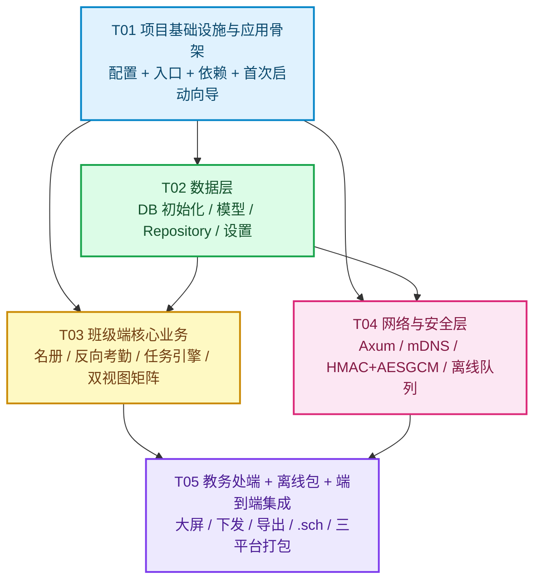

# 局域网分布式教务与班级协同工作台 — 任务分解

> 项目根目录：`lan-workbench/`
> 关联文档：`docs/01-architecture.md`（架构）、`docs/02-ddl.sql`（数据结构）
> 本文件是工程实现的**唯一施工单**，包含任务列表、依赖关系、并行批次与跨文件共享约定。

---

## 1. 任务总览

任务按**功能模块 + 层次**划分为 5 个顶层任务（T01–T05），每个顶层任务包含若干子项（T0x.y）。
**划分原则**：配置与入口集中在一个任务；同层同模块的文件归在一起；任务间尽量只依赖 T01/T02，减少线性链。

| 任务 | 名称 | 复杂度 | 前置依赖 | 可并行 |
|---|---|---|---|---|
| **T01** | 项目基础设施与应用骨架 | L | — | — |
| **T02** | 数据层：DB 初始化、模型与 Repository | L | T01 | — |
| **T03** | 班级端核心业务（名册 / 考勤 / 任务引擎） | L | T01, T02 | ✅ 与 T04 并行 |
| **T04** | 网络与安全层（Axum / mDNS / 加密 / 离线队列） | L | T01, T02 | ✅ 与 T03 并行 |
| **T05** | 教务处端、离线包与端到端集成 | L | T03, T04 | — |

---

## 2. 任务详情

### T01 — 项目基础设施与应用骨架

**复杂度**：L ｜ **前置**：无 ｜ **目标**：能 `pnpm tauri dev` 启动一个空白窗口，且首次启动向导可完成并落库模式配置。

**涉及文件**

```
package.json, package-lock.json, vite.config.ts, tsconfig.json, tsconfig.node.json,
tailwind.config.js, postcss.config.js, index.html, .gitignore, .env.example, README.md,
public/favicon.svg, public/empty-illustration.svg,
src/main.tsx, src/App.tsx, src/index.css, src/vite-env.d.ts,
src/router/index.tsx,
src/constants/app.ts, src/constants/ui.ts,
src/lib/tauri.ts, src/lib/events.ts, src/lib/format.ts, src/lib/crypto.ts,
src/store/useAppStore.ts,
src/hooks/useTauriEvent.ts, src/hooks/useBootstrap.ts, src/hooks/useBigScreen.ts,
src/components/layout/AppShell.tsx, SideNav.tsx, TopBar.tsx, ModeBadge.tsx, StatusBar.tsx,
src/components/ui/Button.tsx, IconButton.tsx, Card.tsx, Badge.tsx, Modal.tsx, Drawer.tsx,
src/components/ui/Select.tsx, Input.tsx, Textarea.tsx, Toggle.tsx, Tabs.tsx, Table.tsx,
src/components/ui/Tooltip.tsx, EmptyState.tsx, Spinner.tsx, ConfirmDialog.tsx,
src/components/ui/Toast.tsx, ProgressBar.tsx,
src/components/setup/FirstRunWizard.tsx, ModeSelectStep.tsx, IdentityStep.tsx, KeyStep.tsx,
src/pages/SetupPage.tsx, src/pages/SettingsPage.tsx,
src/types/index.ts, src/types/enums.ts,
src-tauri/Cargo.toml, build.rs, tauri.conf.json, tauri.macos.conf.json,
src-tauri/tauri.windows.conf.json, src-tauri/tauri.linux.conf.json,
src-tauri/capabilities/default.json, src-tauri/icons/*,
src-tauri/src/main.rs, lib.rs, app.rs, error.rs, state.rs,
src-tauri/src/config/mod.rs, constants.rs,
src-tauri/src/commands/mod.rs
```

**子项**

| 子项 | 内容 |
|---|---|
| T01.1 | Node 侧工程化：`package.json`（含 `@tauri-apps/api`、`@tauri-apps/cli`、`react`、`react-dom`、`react-router-dom`、`zustand`、`lucide-react`、`xlsx`）、Vite/TS/PostCSS/Tailwind 配置（Tailwind 扩展大屏 `fontSize` 与高对比色板）、`index.html`、`.gitignore` |
| T01.2 | Tauri 侧工程化：`Cargo.toml`（tauri v2、tauri-plugin-sql、tokio、serde、serde_json、thiserror、uuid、chrono 及后续任务所需的 axum/mdns-sd/aes-gcm/hmac/sha2/reqwest/calamine/rust_xlsxwriter 一次性声明）、`tauri.conf.json` + 三平台覆盖配置、`capabilities/default.json`、`build.rs`、图标 |
| T01.3 | Rust 骨架：`main.rs`/`lib.rs`/`app.rs`（Builder 装配、state 注入、命令注册占位）、`error.rs`（`AppError` + `ErrorCode` + `Serialize`）、`state.rs`、`config/constants.rs` |
| T01.4 | 前端骨架：`main.tsx`/`App.tsx`/`index.css`、路由表（含 mode 守卫与未初始化重定向）、`lib/tauri.ts`（invoke 封装 + 错误归一化）、`lib/events.ts`、`hooks/*`、`useAppStore` |
| T01.5 | UI 基础组件库（18 个大屏组件：大字号、≥44px 触控区、高对比、焦点环）与布局组件（AppShell/SideNav/TopBar/ModeBadge/StatusBar） |
| T01.6 | 首次启动向导：三步（模式 → 身份 → 密钥）+ `SetupPage`；`SettingsPage` 基础版（模式切换、UI 缩放、端口展示） |

**验收标准**

1. `pnpm install && pnpm tauri dev` 在 macOS 与 Windows 均能编译并弹出窗口，无控制台报错。
2. Tailwind 生效，根字号经 `useBigScreen` 按屏幕宽度自动设置（≥1920px → scale 1.5）。
3. 首次启动强制进入向导；完成后写入 `app_settings.first_run_done=true`，重启直连主页。
4. `src/router/index.tsx` 能按 `appMode` 路由守卫：client 模式访问 `/master/*` 会被重定向。
5. `lib/tauri.ts` 的 invoke 对 Rust 返回的 `{code,message}` 错误能统一抛 `AppError` 并 Toast 中文提示。
6. 所有 UI 组件在 1.25/1.5 缩放下无文字截断、无横向滚动条。

---

### T02 — 数据层：DB 初始化、模型与 Repository

**复杂度**：L ｜ **前置**：T01 ｜ **目标**：13 张表全部可用，Rust 结构体与 TS 类型一一对应，repo 层通过单元级冒烟。

**涉及文件**

```
src-tauri/migrations/001_init.sql,
src-tauri/src/db/mod.rs, migrations.rs, models.rs,
src-tauri/src/db/repo/mod.rs, student_repo.rs, checkin_repo.rs, task_repo.rs,
src-tauri/src/db/repo/broadcast_repo.rs, device_repo.rs, queue_repo.rs,
src-tauri/src/db/repo/sync_repo.rs, package_repo.rs, settings_repo.rs,
src-tauri/src/config/settings.rs,
src-tauri/src/commands/settings_cmd.rs, student_cmd.rs,
src/types/models.ts, src/types/api.ts, src/types/broadcast.ts, src/types/events.ts,
src/constants/status.ts,
src/lib/db.ts,
src/store/useStudentStore.ts, useDeviceStore.ts, useQueueStore.ts
```

**子项**

| 子项 | 内容 |
|---|---|
| T02.1 | 数据库初始化：`db/mod.rs` 建连接池、`PRAGMA foreign_keys=ON`、`busy_timeout=5000`；`db/migrations.rs` 注册 `001_init.sql`（**若 sqlx 不支持多语句，按 `;\n` 拆分逐条执行**）；启动时 `integrity_check` |
| T02.2 | Rust 模型 `db/models.rs`：`Student`、`CheckinRecord`、`CustomTask`、`TaskStatusNode`、`TaskRecord`、`BroadcastTask`、`BroadcastReceipt`、`Device`、`PendingQueueItem`、`SyncLogEntry`、`AppSetting`、`ImportBatch`、`OfflinePackage`，全部 `serde` + 与 TS 字段同名 |
| T02.3 | TS 类型镜像 `src/types/models.ts`、`api.ts`、`broadcast.ts`、`events.ts`、`enums.ts`；`constants/status.ts` 状态字典（label/emoji/color/icon/循环顺序） |
| T02.4 | 8 个 repo 模块：全部 SQL 唯一出口，含软删过滤（`deleted_at IS NULL`）、`dirty`/`sync_state` 维护、批量事务导入、矩阵查询、汇总聚合、队列合并入队（`ON CONFLICT DO UPDATE`） |
| T02.5 | `config/settings.rs` KV 读写 + 默认值兜底；`commands/settings_cmd.rs`（get/set/complete_setup/switch_mode/rotate_key）、`student_cmd.rs`（list/upsert/batch_import/update_status） |
| T02.6 | 前端 `lib/db.ts` 数据服务 + 三个 store（学生/设备/队列） |

**验收标准**

1. 冷启动在新机器上自动建库建表；重复启动不报错（全部 `IF NOT EXISTS`）。
2. `sqlite3` 打开产物库，`PRAGMA foreign_key_check` 与 `integrity_check` 均返回 ok。
3. `trg_nodes_max4` 触发器生效：插入第 5 个状态节点抛 `TASK_NODE_LIMIT`。
4. `ux_queue_dedup` 生效：同 `(entity_type, entity_id, op_type, target)` 重复入队不产生新行，仅覆盖 payload。
5. `student_batch_import` 500 行中途失败能整体回滚，`import_batches` 记录 `failed_rows` 与 `error_report`。
6. TS 类型与 Rust 结构体字段名逐一致（见 §4.2 映射表），`tsc --noEmit` 通过。
7. 删除学生时 `checkin_records` 与 `task_records` 级联软删/物理删符合外键定义。

---

### T03 — 班级端核心业务（名册 / 反向考勤 / 自定义任务引擎）

**复杂度**：L ｜ **前置**：T01, T02 ｜ **目标**：单机（不联网）完整跑通班级端三大功能。

**涉及文件**

```
src-tauri/src/commands/checkin_cmd.rs, task_cmd.rs, broadcast_cmd.rs,
src-tauri/src/import_export/mod.rs, xlsx.rs, csv.rs,
src/lib/excel.ts, src/lib/csv.ts, src/lib/download.ts,
src/hooks/useDebouncedCallback.ts, src/hooks/useKeyboardCycle.ts,
src/store/useCheckinStore.ts, useTaskStore.ts, useBroadcastStore.ts,
src/components/student/StudentImportDialog.tsx, StudentTable.tsx, StudentStatusBadge.tsx,
src/components/student/StudentEditDrawer.tsx, StudentPicker.tsx,
src/components/checkin/CheckinGrid.tsx, CheckinStudentCard.tsx, CheckinSummaryBar.tsx,
src/components/checkin/CheckinDatePicker.tsx, CheckinExceptionList.tsx,
src/components/task/TaskList.tsx, TaskEditorDialog.tsx, StatusNodeEditor.tsx,
src/components/task/TaskMatrixGrid.tsx, TaskMatrixTable.tsx, TaskCell.tsx,
src/components/task/ScorePopover.tsx, NotePopover.tsx, TaskProgressSummary.tsx,
src/components/task/TaskDetailDrawer.tsx,
src/components/broadcast/BroadcastAcceptBar.tsx,
src/pages/client/ClientHomePage.tsx, CheckinPage.tsx, StudentsPage.tsx, TasksPage.tsx,
src/pages/client/TaskMatrixPage.tsx, BroadcastInboxPage.tsx
```

**子项**

| 子项 | 内容 |
|---|---|
| T03.1 | 名册：`.xlsx`/`.csv` 导入（列映射 + 行级校验 + 错误报告 + 事务批量）、表格筛选（在读/请假/已转出）、编辑抽屉、状态变更（转出自动排除统计） |
| T03.2 | 反向考勤：`CheckinGrid` 默认全体在读生为 🟢；点击循环 `present → leave → absent → present`（`late` 显式可选）；乐观更新 + 失败回滚；`CheckinSummaryBar` 实时出勤率；`useKeyboardCycle` 键盘快捷；`checkin_cmd.rs` 落库 |
| T03.3 | 任务引擎：任务 CRUD、状态节点编辑器（2~4 个，颜色/图标/顺序/is_final/is_default）、任务类型与评分/备注开关、截止时间 |
| T03.4 | 双视图矩阵：`TaskMatrixGrid`（网格卡片矩阵，大屏）与 `TaskMatrixTable`（表格矩阵）；单元格点击循环切换节点；`ScorePopover`（0–100）、`NotePopover`；`TaskProgressSummary` 节点人数分布 |
| T03.5 | 教务指令接收（本地部分）：`BroadcastInboxPage` 收件箱 + `BroadcastAcceptBar` 一键生成 `CustomTask` + `TaskStatusNode[]` + 全员 `TaskRecord` 初始化（事务） |

**验收标准**

1. 导入 60 行 `.xlsx` 名册 ≤ 2s，错误行精确定位到行号与字段并可在弹窗中查看。
2. 考勤点击响应 < 16ms（乐观更新），落库 < 10ms；断网状态下全部功能可用。
3. 「已转出」学生不出现在考勤网格与任何日常统计中，但历史考勤可查。
4. 任务状态节点：第 5 个节点保存时前端给出中文拦截提示（后端触发器兜底）。
5. 矩阵视图：60 学生 × 单任务切换流畅；`TaskMatrixGrid` 与 `TaskMatrixTable` 共享同一份状态，切换视图不丢数据。
6. 评分仅接受 0–100 整数；备注 ≤ 500 字（前端截断 + 后端校验）。
7. 一键生成待办在单事务内完成，失败整体回滚且收件箱状态不变。

---

### T04 — 网络与安全层（Axum / mDNS / 加密 / 离线队列）

**复杂度**：L ｜ **前置**：T01, T02 ｜ **目标**：两台机器在局域网内自动互见，考勤变更异步可靠送达，断网后自动补发。

**涉及文件**

```
src-tauri/src/security/mod.rs, hmac.rs, cipher.rs, envelope.rs, nonce.rs, keystore.rs,
src-tauri/src/net/mod.rs, server.rs, handlers.rs, middleware.rs, client.rs,
src-tauri/src/net/discovery.rs, heartbeat.rs,
src-tauri/src/sync/mod.rs, outbox.rs, worker.rs, backoff.rs,
src-tauri/src/commands/device_cmd.rs, sync_cmd.rs,
src-tauri/src/db/repo/device_repo.rs（配合）,
src/components/layout/SyncIndicator.tsx,
src/components/sync/PendingQueuePanel.tsx, SyncLogPanel.tsx,
src/hooks/useAutoSync.ts, src/store/useQueueStore.ts（配合）
```

**子项**

| 子项 | 内容 |
|---|---|
| T04.1 | 安全层：`hmac.rs`（canonical string + 签名 + 常量时间比较）、`cipher.rs`（HKDF 派生 + AES-256-GCM）、`envelope.rs`（`seal`/`open` + 校验序）、`nonce.rs`（LRU + TTL 600s 防重放）、`keystore.rs`（生成/读取/轮换/指纹，优先系统钥匙串） |
| T04.2 | mDNS 自发现：`discovery.rs` 注册（`_schworkbench._tcp.local.` + TXT 元数据）与浏览，产出 `device://found` 事件；`device_repo` upsert；`heartbeat.rs` 周期 ping 与离线判定；`device_cmd.rs` |
| T04.3 | Axum 服务：`server.rs` 路由装配 + 优雅关闭；`middleware.rs` 七步校验（版本→时间戳→nonce→解密→AAD 比对→验签→放行）；`handlers.rs`（`/ping`、`/ingest`、`/broadcast`、`/receipt`、`/pull`）；`client.rs`（封包发送 + 超时 + 连接池） |
| T04.4 | 离线队列：`outbox.rs` 入队与合并策略；`worker.rs` 后台补发循环（取队 → 解析目标 → 发送 → 成功/退避/死信）；`backoff.rs` 指数退避 + 抖动；`sync_repo` 日志；`sync_cmd.rs` |
| T04.5 | 前端同步可视化：`SyncIndicator`（待发数量/补发动画/离线灯）、`PendingQueuePanel`（失败项与手动重试）、`SyncLogPanel`（错误码明细）、`useAutoSync` |

**验收标准**

1. 两台机器接入同一局域网后 ≤ 5s 内互相出现在设备列表，无需任何 IP 输入。
2. 拔掉网线 → 继续点名 20 次 → 恢复网络后 30s 内全部自动补发完毕，`pending_queue` 清空，无重复数据。
3. 篡改 envelope 中任一字节（cipher/ts/nonce/sig）→ 对端返回对应错误码（`ERR_CRYPTO`/`ERR_TS_WINDOW`/`ERR_NONCE_REPLAY`/`ERR_SIGN`）且**不重试**死信。
4. 重放一条已成功的 `/ingest` 请求 → 返回 `ERR_NONCE_REPLAY`。
5. 节点关机 45s 后在设备列表置灰为离线；重新上线自动恢复在线。
6. `sync_log` 每条记录含 `trace_id`，与 envelope 的 `nonce` 一致，可端到端追踪。
7. 退避策略正确：第 n 次重试间隔 `min(2s × 2^(n-1), 300s) ± 20%`，5 次后转 `dead`。

---

### T05 — 教务处端、离线包与端到端集成

**复杂度**：L ｜ **前置**：T03, T04 ｜ **目标**：教务处端大屏可用，`.sch` 离线包可用，全校端到端联调通过。

**涉及文件**

```
src-tauri/src/commands/broadcast_cmd.rs（补完）, package_cmd.rs,
src-tauri/src/sync/sch_package.rs,
src-tauri/src/import_export/export.rs,
src-tauri/src/db/repo/package_repo.rs（配合）,
src/components/broadcast/BroadcastList.tsx, BroadcastComposer.tsx,
src/components/broadcast/BroadcastTargetPicker.tsx, BroadcastReceiptPanel.tsx,
src/components/dashboard/DeviceMonitorPanel.tsx, SchoolAttendanceBoard.tsx,
src/components/dashboard/UnsubmittedClassList.tsx, ExceptionStudentList.tsx,
src/components/dashboard/StatsCards.tsx, ExportPanel.tsx,
src/components/sync/SchPackageDialog.tsx,
src/lib/exporter.ts,
src/pages/master/MasterHomePage.tsx, DevicesPage.tsx, AttendanceBoardPage.tsx,
src/pages/master/BroadcastPage.tsx, AnalyticsPage.tsx,
src/constants/errorCodes.ts（补完）, src/types/events.ts（补完）
```

**子项**

| 子项 | 内容 |
|---|---|
| T05.1 | 节点监控与考勤大屏：`DeviceMonitorPanel`、`SchoolAttendanceBoard`（全校出勤率汇总）、`UnsubmittedClassList`（未提交班级高亮）、`ExceptionStudentList`（缺勤/请假名单）、`StatsCards` |
| T05.2 | 统一任务下发：`BroadcastComposer`（含内置状态节点模板）、`BroadcastTargetPicker`（全校/年级/班级/指定设备）、`BroadcastList`、`BroadcastReceiptPanel`（已接收/已登记/已完成）；`broadcast_cmd` 补完并接入 T04 的 outbox |
| T05.3 | 数据分析与导出：`AnalyticsPage` 多维统计 + `ExportPanel` + `import_export/export.rs`（rust_xlsxwriter）导出标准 `.xlsx`（冻结首行、多 sheet） |
| T05.4 | `.sch` 离线包：`sch_package.rs`（manifest + SHA-256 + AES-256-GCM 打包/解包/校验）、`package_cmd.rs`、`SchPackageDialog` 导出导入向导、last-write-wins 合并与 `conflict` 标记 |
| T05.5 | 端到端集成：三平台打包配置收尾、空白/异常数据态、性能（1200 格矩阵虚拟滚动）、完整回归清单执行 |

**验收标准**

1. 教务处端 30 个班级节点的出勤率在大屏 ≤ 2s 内完成一次全量刷新；未提交班级红色高亮并置顶。
2. 下发任务到「三年级」→ 该年级全部班级端 ≤ 10s 内收到并出现收件箱红点；回执面板实时显示已接收/已登记数量。
3. 一键导出 `.xlsx`：含「班级汇总」「异常学生明细」「任务完成率」三个 sheet，首行冻结，用 Excel/WPS 均可正常打开。
4. `.sch` 导出 → U 盘拷贝 → 导入：数据完整合并；故意篡改文件后导入被 `ERR_CRYPTO` 拦截且不污染现有数据。
5. 冲突场景：两端同改一条考勤且均 `dirty` → 保留本地、标记 `sync_state='conflict'`，UI 明确提示冲突数量。
6. Windows / macOS / Linux 三平台均可 `tauri build` 成功产出安装包，冷启动 ≤ 3s。

---

## 3. 依赖关系图



### 3.1 实现批次（含并行建议）

| 批次 | 任务 | 人员建议 | 说明 |
|---|---|---|---|
| **批次 1** | T01 | 1 人 | 必须最先完成，产出可运行骨架 |
| **批次 2** | T02 | 1 人 | T01 完成后立即开始；是 T03/T04 的共同底座 |
| **批次 3（并行）** | **T03** ∥ **T04** | 2 人并行 | 两人互不冲突：T03 只碰 `commands/checkin|task|broadcast` + 前端业务页；T04 只碰 `security/`、`net/`、`sync/` + 同步可视化。**唯一交叉点**是 `sync::outbox::enqueue()` 的签名，需在开工前锁定（见 §4.6） |
| **批次 4** | T05 | 1–2 人 | 依赖 T03 的业务数据与 T04 的传输能力 |

**关键并行约束**：T03 在调用尚未实现的 `outbox::enqueue()` 时，先依赖 T02 已落地的 `queue_repo` 直连写 `pending_queue`（T04 完成后无缝替换为 `sync::outbox` 封装），保证两条线不被阻塞。

---

## 4. 共享知识（跨文件约定，强制遵守）

### 4.1 Tauri 命令命名规范

- 格式：`<domain>_<action>`，**全部 snake_case**，Rust 侧与前端调用名**完全一致**。
- `domain` ∈ `settings | student | checkin | task | broadcast | device | sync | package`。
- `action` ∈ `list | get | upsert | delete | mark | send | flush | retry | export | import | query`。
- 命令一律 `async fn`，返回 `Result<T, AppError>`；`AppError` 序列化为 `{ code, message }`。
- 前端**禁止**裸调 `invoke()`，必须走 `src/lib/tauri.ts` 的封装。

### 4.2 TS 类型 ↔ Rust 结构体 ↔ SQLite 字段映射（核心字段）

| TS 类型 | Rust 类型 | SQLite 列 | 说明 |
|---|---|---|---|
| `string` | `String` | `TEXT` | UUID v4 小写带连字符（36 字符） |
| `number`（毫秒） | `i64` | `INTEGER` | Unix epoch **毫秒**，UTC |
| `number`（小整数） | `i32` | `INTEGER` | score / node_order / attempt_count |
| `boolean` | `bool` | `INTEGER` | 0/1，CHECK 约束保证 |
| `number \| null` | `Option<i64>` | `INTEGER NULL` | 可空时间 |
| `string \| null` | `Option<String>` | `TEXT NULL` | 可空文本 |
| `T[]` | `Vec<T>` | — | 不落单列，走 JSON 或子表 |
| `Record<string, unknown>` | `serde_json::Value` | `TEXT`（JSON） | payload / error_report / entity_counts |
| `AppMode` | `enum AppMode` | `TEXT` | `'client' \| 'master'` |
| `SyncState` | `enum SyncState` | `TEXT` | `'local' \| 'pending' \| 'synced' \| 'conflict'` |

**实体字段对照（以 Student 为例，其余同构）**

| TS (`Student`) | Rust (`Student`) | SQLite (`students`) |
|---|---|---|
| `id: string` | `id: String` | `id TEXT PK` |
| `studentNo: string` | `student_no: String` | `student_no TEXT` |
| `name: string` | `name: String` | `name TEXT` |
| `gender: 'male'\|'female'\|'unknown'` | `gender: String` | `gender TEXT` |
| `grade?: string \| null` | `grade: Option<String>` | `grade TEXT` |
| `className?: string \| null` | `class_name: Option<String>` | `class_name TEXT` |
| `seatNo?: number \| null` | `seat_no: Option<i64>` | `seat_no INTEGER` |
| `status: StudentStatus` | `status: String` | `status TEXT` |
| `createdAt: number` | `created_at: i64` | `created_at INTEGER` |
| `deletedAt: number \| null` | `deleted_at: Option<i64>` | `deleted_at INTEGER` |
| `syncState: SyncState` | `sync_state: String` | `sync_state TEXT` |
| `dirty: boolean` | `dirty: bool` | `dirty INTEGER` |

> **命名转换统一在 serde 层完成**：Rust 结构体加 `#[serde(rename_all = "camelCase")]`，使 JSON 直接是 `studentNo`/`className`/`createdAt`，前端零转换。
> **数据库列名保持 snake_case**，由 repo 层负责 `snake_case ↔ camelCase` 的映射。

### 4.3 错误码表

| 错误码 | HTTP | 中文提示 | 触发场景 | 是否重试 |
|---|---|---|---|---|
| `ERR_DB` | 500 | 数据库操作失败，请重试 | SQL 执行异常、约束冲突 | ✅ |
| `ERR_NET` | 502 | 网络不可达，已加入待发队列 | 连接超时、对端离线 | ✅ |
| `ERR_SIGN` | 401 | 签名校验失败，请检查共享密钥 | HMAC 不匹配、AAD 被替换 | ❌ |
| `ERR_CRYPTO` | 401 | 报文解密失败，数据可能已损坏 | AES-GCM tag 校验失败、kid 未知 | ❌ |
| `ERR_TS_WINDOW` | 401 | 时间偏差过大，请校准本机时间 | `abs(ts-now) > 300s` | ❌ |
| `ERR_NONCE_REPLAY` | 401 | 检测到重复请求，已拒绝 | nonce 重复命中 | ❌ |
| `ERR_VALIDATION` | 400 | 参数校验失败 | 缺字段、score 越界、节点数超限 | ❌ |
| `ERR_NOT_FOUND` | 404 | 记录不存在或已删除 | 查无此 id / 已软删 | ❌ |
| `ERR_MODE` | 409 | 当前运行模式不支持该操作 | client 端调用下发接口 | ❌ |
| `ERR_PERMISSION` | 403 | 无文件或网络权限 | 未授权写盘、防火墙拒绝 | ❌ |
| `ERR_IMPORT` | 422 | 导入数据有误，请查看错误报告 | 名册/离线包解析失败 | ❌ |
| `ERR_UNKNOWN` | 500 | 发生未知错误 | 兜底 | ❌ |

前端 `src/constants/errorCodes.ts` 维护 `code → 中文提示 + 是否可重试 + 建议操作` 三元组，`Toast` 直接查表展示。

### 4.4 事件（Event）名列表

Rust → 前端（`app_handle.emit_all`）：

| 事件名 | Payload | 触发时机 | 订阅方 |
|---|---|---|---|
| `device://found` | `Device` | mDNS 解析到新节点 | `useDeviceStore` |
| `device://lost` | `{ deviceId }` | mDNS goodbye 或超时 | `useDeviceStore` |
| `device://heartbeat` | `{ deviceId, latencyMs, ts }` | 心跳成功 | `useDeviceStore` |
| `device://offline` | `{ deviceId }` | 连续失败超 TTL | `useDeviceStore` |
| `sync://progress` | `{ pending, sending, lastError? }` | 队列变化/补发完成 | `SyncIndicator` |
| `sync://error` | `{ queueId, code }` | 条目转死信 | `PendingQueuePanel` |
| `checkin://updated` | `{ date, period, classId }` | 收到对端考勤增量 | 大屏 / 考勤页 |
| `task://updated` | `{ taskId }` | 任务或矩阵变更 | `useTaskStore` |
| `broadcast://received` | `BroadcastTask` | 班级端收到下发任务 | `BroadcastInboxPage` |
| `broadcast://receipt` | `BroadcastReceipt` | 回执到达（任一方向） | `BroadcastReceiptPanel` |
| `data://imported` | `ImportReport` | 名册或 `.sch` 导入完成 | `useStudentStore` 等 |
| `mode://changed` | `{ mode }` | 模式热切换 | `useBootstrap` |
| `package://progress` | `{ current, total, phase }` | 导出/导入进度 | `SchPackageDialog` |

前端 → Rust：无（一律走 `invoke` 命令，事件仅用于服务端推送，避免双向事件循环）。

### 4.5 端口与 mDNS 服务类型常量

| 常量 | 值 | 位置 |
|---|---|---|
| `API_PORT` | `5178`（被占用时向后探测 `5179–5188`） | `src-tauri/src/config/constants.rs` ↔ `packages/shared/src/constants/app.ts` |
| `MDNS_SERVICE_TYPE` | `_schworkbench._tcp.local.` | 同上 |
| `MDNS_PORT` | `5353`（UDP，系统标准） | 同上 |
| `API_VERSION` | `v1` → 路径前缀 `/api/v1` | 同上 |
| `HEARTBEAT_INTERVAL_SEC` | `15` | 同上 |
| `OFFLINE_TTL_SEC` | `45` | 同上 |
| `HMAC_TS_WINDOW_SEC` | `300` | 同上 |
| `NONCE_TTL_SEC` | `600`（= 2 × 窗口） | 同上 |
| `QUEUE_MAX_ATTEMPTS` | `5` | 同上 |
| `BACKOFF_BASE_MS` | `2000` | 同上 |
| `BACKOFF_CAP_MS` | `300000` | 同上 |
| `BACKOFF_JITTER` | `±20%` | 同上 |
| `DB_BUSY_TIMEOUT_MS` | `5000` | 同上 |
| Vite dev 端口（教务端） | `1420` / HMR `1421` | `apps/affairs/vite.config.ts` |
| Vite dev 端口（班级端） | `1430` / HMR `1431` | `apps/classroom/vite.config.ts` |

**双实例同机联调**：

- 两端 P2P API 都从 `5178` 起向后探测 `5179–5188`，自然错开（例如教务 `5178` + 班级 `5179`）。
- 前端 dev 端口不参与业务协议：mDNS TXT `role` + 实际 API 端口是发现与建联的唯一依据。

**mDNS TXT Record 键**（全部小写，短键以控制包长）：

| 键 | 示例 | 说明 |
|---|---|---|
| `v` | `1` | 协议版本 |
| `role` | `client` / `master` | 角色 |
| `grade` | `3` | 年级 |
| `class` | `三年级二班` | 班级（UTF-8） |
| `api` | `v1` | API 版本 |
| `kid` | `k1` | 密钥标识 |

### 4.6 锁定接口（跨任务并行契约，开工前不得变更）

```rust
// src-tauri/src/sync/outbox.rs —— T03 唯一需要的同步入口
pub fn enqueue(
    db: &DbPool,
    entity_type: &str,   // "student" | "checkin" | "custom_task" | "task_node"
                         // | "task_record" | "broadcast_task" | "receipt" | "device"
    entity_id: &str,
    op_type: &str,       // "upsert" | "delete" | "ack" | "heartbeat" | "broadcast"
    payload: serde_json::Value,
    priority: i32,       // 考勤=1，任务=3，名册=5，广播=2
) -> Result<String, AppError>;   // 返回 queue_id
```

```rust
// src-tauri/src/security/envelope.rs —— T04 内部 + T05 .sch 复用
pub struct Envelope { pub v: i32, pub alg: String, pub from: String, pub to: String,
                      pub ts: i64, pub nonce: String, pub kid: String, pub iv: String,
                      pub aad: String, pub cipher: String, pub tag: String, pub sig: String }
pub fn seal(payload: &[u8], ctx: &SealCtx) -> Result<Envelope, AppError>;
pub fn open(env: &Envelope, root_key: &[u8]) -> Result<Vec<u8>, AppError>;
```

```ts
// src/lib/tauri.ts —— 前端唯一调用出口
export async function invokeCmd<T>(cmd: string, args?: Record<string, unknown>): Promise<T>;
// 内部：错误归一化 -> AppError{code,message} -> Toast（可配置 silent）
```

### 4.7 其他全局约定

1. **时间**：所有时间戳为 **毫秒 epoch UTC**；日期字符串为 `YYYY-MM-DD`（本地日历日，不做时区转换）。
2. **软删**：业务表一律 `deleted_at IS NULL` 为有效；删除操作写 `deleted_at = now`，**不物理删除**（`pending_queue` 的 `done` 条目除外，可定期清理 7 天前记录）。
3. **UUID**：v4，小写带连字符，由 Rust 侧 `uuid::Uuid::new_v4()` 生成；前端乐观更新时用 `crypto.randomUUID()` 生成**临时 id**，服务端返回后替换。
4. **查询默认过滤**：所有 repo 查询默认追加 `deleted_at IS NULL`，除非显式传 `includeDeleted: true`。
5. **大屏基线**：正文 ≥ 18px（scale 1.5 下 ≥ 27px），触控目标 ≥ 44×44px，正文对比度 ≥ 4.5:1，状态色必须**同时**用颜色 + 图标/文字区分（色盲友好）。
6. **状态色 token**：`present=#16a34a`(绿)、`leave=#ca8a04`(琥珀)、`absent=#dc2626`(红)、`late=#ea580c`(橙)、`transferred=#64748b`(灰)。
7. **日志**：Rust 侧统一 `tracing`（`info!` 记录请求摘要，`warn!`/`error!` 记录失败），前端错误上报 `sync_log`（仅同步类）。
8. **禁止**：前端直接写 SQL；`commands` 层写裸 SQL；`security` 模块依赖 `db`。

### 4.8 双 App 启动与构建（v1.1 拆分后）

**目录**：

```
lan-workbench/
├── apps/
│   ├── affairs/        # 教务端入口（identifier: cn.yipaike.lanworkbench.affairs）
│   └── classroom/      # 班级端入口（identifier: cn.yipaike.lanworkbench.classroom）
├── packages/shared/    # 两端共享：types / components / stores / lib / styles
└── src-tauri/          # 共享 Rust 后端
```

**根脚本**：

| 脚本 | 作用 |
|---|---|
| `npm run dev:affairs` | Vite dev 1420（教务端前端） |
| `npm run dev:classroom` | Vite dev 1430（班级端前端） |
| `npm run build:affairs` | tsc + `vite build` → `dist/affairs` |
| `npm run build:classroom` | tsc + `vite build` → `dist/classroom` |
| `npm run tauri:dev:affairs` | Tauri 启动教务端（含 dev identifier override） |
| `npm run tauri:dev:classroom` | Tauri 启动班级端（含 dev identifier override） |
| `npm run tauri:build:affairs` | 产物：教务端安装包 |
| `npm run tauri:build:classroom` | 产物：班级端安装包 |
| `npm run check:boundaries` | 静态检查端边界（router 不引用另一端页面） |
| `npm run check:build-targets` | 静态检查端脚本与 Tauri 配置齐全 |

**同机双开**：

1. 两端使用不同 identifier → Tauri 把它们装到不同应用数据目录，设备 ID / SQLite / 模式相互独立。
2. Vite dev 端口固定 1420 / 1430，不冲突。
3. P2P API 都从 5178 起自动探测；同机时一个用 5178、另一个用 5179；通过 mDNS TXT `role` + 实际端口建联。
4. 共享密钥两端必须完全一致，否则建联后解密失败不同步。

**默认 `src-tauri/tauri.conf.json`**：保留为教务端配置（与 `tauri.affairs.conf.json` 等价），仅用于裸 `cargo` 构建。**正式出包**一律使用 `tauri:build:affairs` / `tauri:build:classroom`，它们通过 `--config` 显式选择 target 并设置 `TAURI_CONFIG`，绕开默认配置。

**旧版综合 app 数据**：**不迁移**。新 identifier 对应全新应用数据目录；旧数据库保留在原位置，不读取、不删除、不转换。重复创建 `app_mode` 写入逻辑会按 app target 强制覆盖篡改值。

---

## 5. 回归验收清单（T05 完成后整体执行）

- [ ] 冷启动建库 → 向导 → 进入主页（三平台）
- [ ] 导入 60 人名册（正常 + 含 3 行错误数据）
- [ ] 反向标记 10 名学生，出勤率实时正确
- [ ] 学生转出 → 从考勤网格消失，历史可查
- [ ] 创建任务 + 3 个状态节点 → 矩阵网格/表格双视图切换与打点
- [ ] 评分 0/50/100 边界，越界被拦截
- [ ] 断网点名 20 次 → 恢复网络自动补发 → `pending_queue` 清空
- [ ] 篡改报文 → 四类安全错误码各命中一次
- [ ] 教务处下发到「三年级」→ 班级端收件箱 + 一键生成待办 + 回执回流
- [ ] 大屏：未提交班级高亮、异常学生名单、全校出勤率
- [ ] 导出 `.xlsx` 三 sheet 可用 Excel/WPS 打开
- [ ] `.sch` 导出 → 篡改 → 导入被拦截；正常导入合并成功
- [ ] 冲突场景标记 `sync_state='conflict'` 并提示
- [ ] 30 班级 × 40 人（1200 格）矩阵滚动流畅
